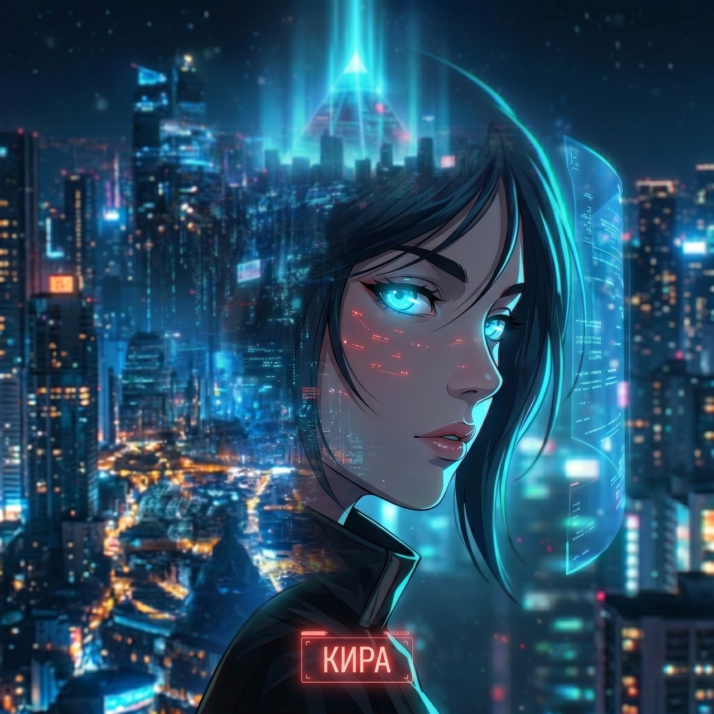
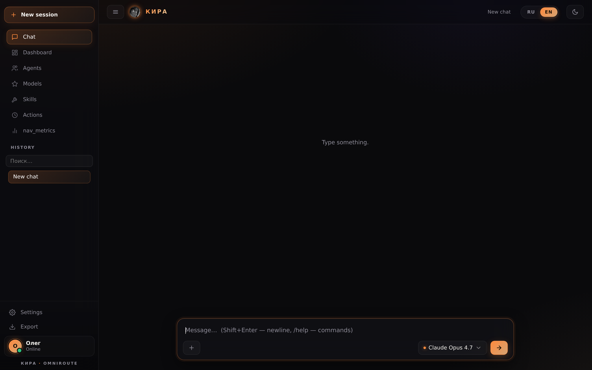
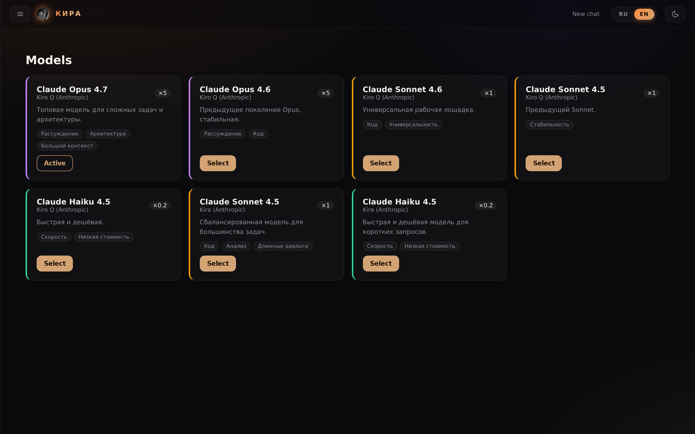
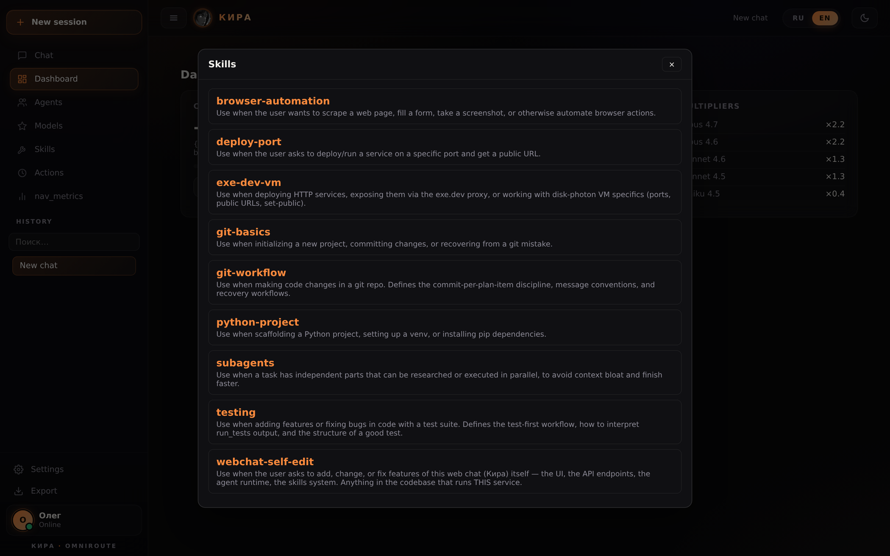

<p align="center">
  <picture>
    <source media="(prefers-color-scheme: dark)" srcset="assets/kira-noir.jpg" />
    
  </picture>
</p>

<h1 align="center">🌸 Кира</h1>

<p align="center">
  <i>самомодифицирующийся AI-агент с веб-интерфейсом, sandbox и долговременной памятью</i>
</p>

<p align="center">
  <a href="README.md">🇬🇧 English</a>
  &nbsp;·&nbsp;
  🇷🇺 Русский
  &nbsp;·&nbsp;
  <a href="ARCHITECTURE.md">🗺️ Architecture guide</a>
</p>

<p align="center">
  <a href="https://github.com/olegvrv21-del/kira/actions/workflows/ci.yml"></a>
  
  
  
</p>

---

Кира — это полноценный AI-агент, который умеет редактировать собственный
исходный код, гонять тесты, коммитить, ходить в браузер и помнить контекст
между сессиями. Работает как FastAPI-сервис, стримит ответы по SSE и
поднимает чат-UI с **38 инструментами** в Docker-песочницах (по одной на сессию).

## Screenshots

<table>
<tr>
  <td align="center" width="33%"><br/><sub><b>Чат</b> — брендированный UI, двуязычный, с пульсирующей аватаркой</sub></td>
  <td align="center" width="33%"><br/><sub><b>Модели</b> — выбор LLM с ценовыми множителями и тегами задач</sub></td>
  <td align="center" width="33%"><br/><sub><b>Skills</b> — подключаемые playbooks для специфичных доменов</sub></td>
</tr>
</table>

## Stack

- **Backend**: FastAPI + uvicorn (Python 3.11+)
- **Storage**: SQLite (`agent_sessions.db`) — sessions, actions, session_meta
- **LLM**: Amazon Q API (`q.us-east-1.amazonaws.com`), Bearer ksk token
- **Sandbox**: Docker (`kira-sandbox:latest`, based on Playwright Python image) —
  each session gets its own container with a writable bind-mount of the source tree
- **Frontend**: vanilla HTML/JS, SSE for streaming, plain CSS

## Tools (38)

| Category | Tools |
|---|---|
| Shell / FS | `execute_bash`, `fs_read`, `fs_write`, `patch`, `glob`, `grep`, `keyword_search`, `change_dir` |
| Code intel | `outline`, `find_definition`, `find_references`, `rename_symbol`, `diagnostics`, `lint` |
| Execution  | `run_tests`, `verify_change`, `dev_loop`, `coverage_status`, `review_changes` |
| Git        | `git`, `git_commit` |
| Browser    | `browser_navigate`, `browser_click`, `browser_type`, `browser_text`, `browser_eval`, `browser_screenshot`, `browser_console_logs`, `browser_network`, `browser_accessibility`, `browser_emulate`, `output_iframe` |
| Planning   | `plan`, `use_subagent`, `llm_one_shot`, `load_skill` |
| Memory     | `memory_add`, `memory_search` |

## Features

- **Action history & rollback** — every `fs_write` / `patch` stores a backup;
  one click restores any past edit, with inline unified diff.
- **Plan UI** — agent maintains a visible checklist (pending / in_progress / done / skipped).
- **Self-edit** — with `KIRA_SELF_EDIT=1` the source tree is bind-mounted into
  the sandbox at `/host/webchat:rw`, so Кира can modify her own files and commit
  them via `git_commit`.
- **Long-term memory** — notebook directory mounted at `/host/notebook` for
  cross-session notes (`STATUS.md`, `JOURNAL.md`, `TODO.md`, ...).
- **Skills** — markdown playbooks loaded on demand (`browser-automation`,
  `git-workflow`, `testing`, `python-project`, ...).
- **Daily backups** — systemd timer dumps source + DB + notebook to `~/backups/`,
  keeps 14 days.
- **Models selector** — UI lets you pick model tier (Opus / Sonnet / Haiku) per task.
- **Multimodal** — image input via base64 in the request body.
- **Telegram-бот** (`ops/tg_bot.py`) — общение с Кирой из TG: markdown
  рендеринг, авторазбивка длинных ответов (безопасно для code-fence),
  фото в base64 → `/agent`, опциональный voice-to-text
  (`faster-whisper` локально или Groq API).
- **Multi-user (lite)** — bearer-токен → `sha256(token)[:12] = user_id`;
  сессии, планы, кредиты, файлы и `/agent` изолированы по владельцу.
  Legacy NULL-owner рекорды видны всем, пока не claim-нутся при первом
  авторизованном save.
- **LLM provider abstraction** (`llm/`) — см. [`llm/README.md`](llm/README.md).
  `base.py` (Message / ToolCall / StreamEvent / `LLMProvider` protocol) +
  `q_provider.py` (с би-конвертерами Q-dict↔Message[]) +
  `mock_provider.py`, выбор через `KIRA_LLM_PROVIDER`. Весь runtime
  (`run_agent`, `_llm_one_shot`, `_run_subagent_silent`) работает на канонических
  сообщениях — vendor lock-in сломан. Добавить провайдера = вписать
  `<vendor>_provider.py`, runtime не трогаем.
- **Push-to-prod CD** — `.github/workflows/deploy.yml`: push в `main` → rsync
  по SSH → `systemctl restart webchat` + `kira-tg-bot` → smoke `/healthz`
  → TG-alert при ошибке. Латенси ~50с.

## Layout

```
agent_runtime.py      # SSE chat loop, tool dispatch, action logging
agent_tools.py        # host-mode tools
agent_tool_specs.json # OpenAPI-style tool schema sent to Q
agent_system_prompt.txt
agent_store.py        # SQLite layer
sandbox_runtime.py    # spawns + talks to per-session Docker container
sandbox_tools.py      # sandbox-mode tools (extended browser, git, run_tests, ...)
sandbox/              # Dockerfile, browser_daemon.py, entrypoint.sh
app.py                # FastAPI endpoints, SSE
index.html            # frontend
q_client.py           # Kiro Q API client
ops/                  # systemd units, backup.sh
skills/               # markdown playbooks
tests/                # 710 pytest + smoke script
```

## Quick start

### 🐳 Docker (рекомендуется)

```bash
git clone https://github.com/olegvrv21-del/kira.git && cd kira
./install.sh docker          # builds image, generates auth token, starts
```

→ Открой http://localhost:3000/. Токен в `.env` (`KIRA_AUTH_TOKEN`).

### 🐍 Venv (без Docker)

```bash
./install.sh venv
source .env && .venv/bin/uvicorn app:app --host 0.0.0.0 --port 3000
```

### 🚀 Systemd (продакшен)

```bash
./install.sh systemd         # ставит venv + регистрирует kira.service
systemctl status kira
```

### Manual

```bash
python -m venv .venv
.venv/bin/pip install -r requirements.txt
KIRO_API_KEY=ksk_xxxx .venv/bin/uvicorn app:app --host 0.0.0.0 --port 3000
```

For full sandbox isolation per session also set `KIRA_SANDBOX=1` and build the sandbox image:

```bash
docker build -t kira-sandbox:latest sandbox/
```

См. `.env.example` — все переменные с описанием.

## Tests

```bash
make test    # 710 pytest
make smoke   # live HTTP-проверки против живого сервиса
make all     # both
```

## Status

Production-grade. 710 тестов при ~94% покрытии, CI зелён, push-to-prod CD
живой, развёрнута на disk-photon.exe.xyz. LLM provider abstraction готова;
multi-user lite в проде; Telegram-фронтенд с markdown + photo + voice.
Дальше: реальная LSP-интеграция (pyright + typescript-language-server)
и дальнейшее дробление фронтенда.

## Documentation

- [CHANGELOG.md](CHANGELOG.md) — release history (current: **0.2.0** — Brand & Observability)
- [LICENSE](LICENSE) — MIT

## License

MIT © 2026 Oleg Vorobiev. See [LICENSE](LICENSE).
